# CodeConnect User Guide

Hello fellow student developers! Welcome to your one-stop destination for managing developers' contacts!

CodeConnect is a **developer-first networking application** for student developers to keep track of and reach out easily to other student developers, so they can easily form teams for hackathons.

We are **optimised for use via a Command Line Interface (CLI)** while still having the benefits of a **Graphical User Interface (GUI)**. If you can type fast, CodeConnect can get your contact management tasks done faster than traditional GUI apps.

---

# What can CodeConnect do for you?

- **Add, Edit, Update, Delete** a student developer's contact details
- Record **Tech Stack** and **GitHub Username** for each developer
- **Find** developers by their name, tags, or tech stack
- **Form** and **Manage** your hackathon teams with existing contacts
- **List** all your contacts in the application or within each team
- **Export** your team's details for easy signing up for hackathons
- **Email** your contacts directly from the application

## Table of Contents

- [Introduction](#introduction)
- [Usage of User Guide](#usage-of-user-guide)
- [Installation Guide](#installation-guide)
- [Getting Started](#getting-started)
- [Features](#features)
- [FAQ](#faq)
- [Known Issues](#known-issues)
- [Command Summary](#command-summary)
- [Parameter Constraints](#parameter-constraints)

---

# Introduction

Hey there, aspiring student innovators! 🚀 Welcome to CodeConnect, your passport to a vibrant world of collaboration and innovation! 🌟

Imagine a place where you can manage the details of like-minded student developers effortlessly. A world where forming dream teams for hackathons is not just a possibility, but a seamless reality.

Well, look no further! CodeConnect is your developer-first networking application, designed by student developers for student developers.
Whether you're a coding wizard in Python, a design maestro in UI/UX, or a tech enthusiast exploring new horizons, CodeConnect is your ultimate ally.

So, get ready to explore, connect, and create with CodeConnect! 🎉 Let's turn those tech dreams into reality, one collaboration at a time! 💻✨

[[Jump to Table of Contents]](#table-of-contents)

---

# Usage of User Guide

This guide is designed to help you learn how to use CodeConnect effectively and explore its various features. If you are unfamiliar with programming, don't worry - we have intentionally made it beginner-friendly so that even non-developers will be able to use our guide with ease.

If you're already familiar with CodeConnect, you can skip ahead to the [features](#features), [command summary](#command-summary) or [parameter constraints](#parameter-constraints) sections. <br>
But if you're new to CodeConnect, simply follow along step-by-step to discover how to gather and form your next champion team!

## Keynotes

Before we dive into the guide, let's go over a couple of things to make it more fun for you! Throughout the guide, you'll find some blocks of information that are all jazzed up with colors. They're there to highlight different types of info, so keep an eye out! 🌟

<div class="alert alert-info" markdown="1">
ℹ️: The blue block highlights additional information that might be useful in clearing some confusion.
</div>

<div class="alert alert-warning" markdown="1">
⚠️: The yellow block draws attention to crucial information that requires careful consideration to mitigate potential risks or challenges.
</div>

<div class="alert alert-danger" markdown="1">
❗: The red block highlights information that requires immediate attention due to potential irreversible risks.
</div>

Throughout this guide, you'll see some commands highlighted in these cool little boxes:

```
Text in this box is a command
```

See those CAPITALISED words? They're placeholders for your inputs! Don't stress about the exact values right now; we'll get to that later. So, for example:

```
rate INDEX ts/KEYWORD r/RATING
```

You can jazz it up like this:

```
rate 1 ts/Java r/10
```

Also, keep an eye out for [blue](#blue) hyperlinks! They'll whisk you away to other parts of the guide or even other places online.

Alright, now that we've covered the fun stuff, let's dive in and uncover the power of CodeConnect! 🚀💥

[[Jump to Table of Contents]](#table-of-contents)

---

# Installation Guide

1. Ensure that you have Java 11 installed on your computer. Click <a href="https://blog.hubspot.com/website/check-java-verison#:~:text=First%2C%20find%20and%20click%20on,get%20your%20current%20version%20details">here</a> to learn how to find out what Java version you have! If you do not have Java 11, you can download Java 11 by following the links below:

   - [Windows](https://www.oracle.com/java/technologies/downloads/#java11-windows)

   - [MacOS](https://www.oracle.com/java/technologies/downloads/#java11-mac)

   - [Linux](https://www.oracle.com/java/technologies/downloads/#java11-linux)

2. You might also need to install JavaFX 11. You can find the installation guide [here](https://openjfx.io/openjfx-docs/#install-javafx).

3. Download the latest `codeconnect.jar` from [here](https://github.com/AY2324S2-CS2103T-T12-1/tp/releases).

4. Copy the file to the folder you want to use as the _home folder_ for your CodeConnect, using your system's File Explorer.

5. Open up the <a href="https://support.kaspersky.com/common/windows/14637#block0">command prompt</a> (Windows), <a href="https://support.apple.com/en-sg/guide/terminal/apd5265185d-f365-44cb-8b09-71a064a42125/mac">terminal</a> (Mac) or <a href="https://www.redhat.com/sysadmin/linux-terminal-window">terminal emulator</a> (Linux).

6. Type <code>cd</code> followed by the directory path to the folder where you have saved CodeConnect to. Navigate there and press <code>Enter</code>.

7. Use the `java -jar codeconnect.jar` command to run the application.<br>
8. A GUI similar to the below should appear in a few seconds. <br>
   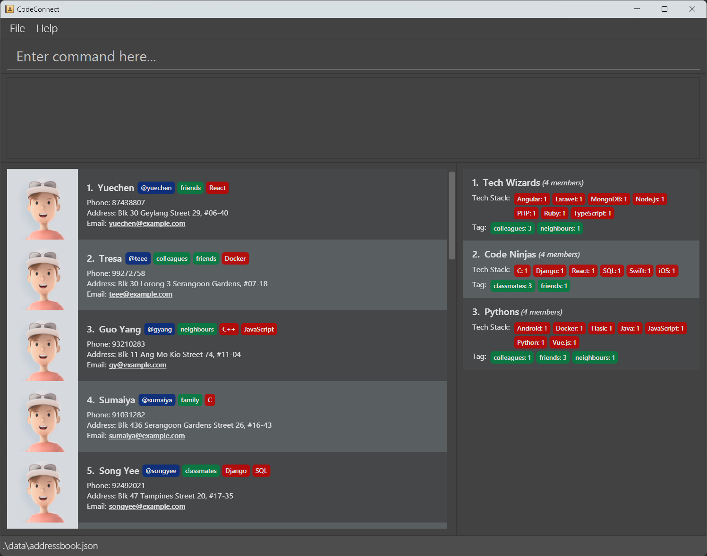

<div class="alert alert-info" markdown="1">
ℹ️ The application might contain some sample data that differs slightly from what you see above! Don't panic, It's just there to help you get started.
</div>

9. Type a command into the command box and press Enter to execute it. <br> Some example commands you can try:

   - `list` : Lists all contacts.

   - `add n/John Doe p/98765432 e/johnd@example.com a/John street, block 123, #01-01 g/johnDoee ts/Java` : Adds a contact named `John Doe` to CodeConnect.

   - `delete 3` : Deletes the 3rd contact shown in the current list.

   - `clear` : Deletes all contacts.

   - `exit` : Exits the application.

10. Refer to the [Features](#features) below for details of each command.

[[Jump to Table of Contents]](#table-of-contents)

---

# Getting Started

Below you will find explanations for each key component in the CodeConnect GUI.

<div class="alert alert-warning" markdown="1">
⚠️ What you see in the GUI may differ slightly from the images below, as it depends on the data that is stored locally!
</div>

1. This is the text input area. This is the most important part of the program. Here is where you will key in the commands you need.<br>
   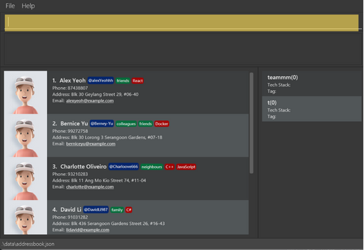

2. This is the file button. Here is where you can exit the program.<br>
   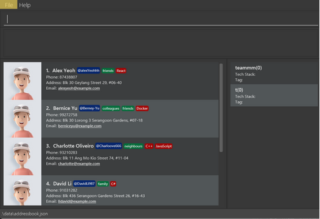

3. This is the help button. Here is where you can find any kind of help with CodeConnect.<br>
   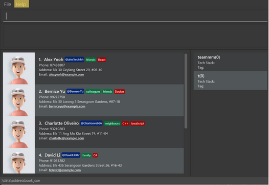

4. This is our teams display panel. All the teams added are displayed here.<br>
   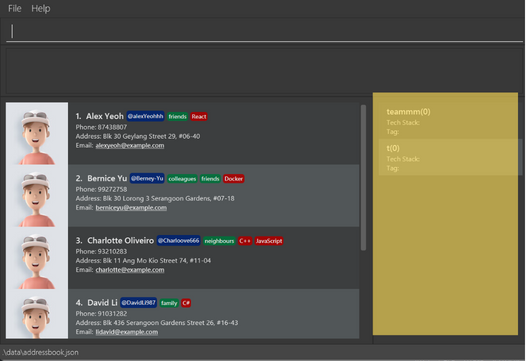

5. This is our response panel. Here is where we provide responses to your CLI commands, or offer assistance for your next command.<br>
   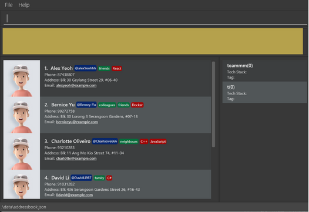

6. This is our contacts display panel. Here is where results of your searches for contacts will be displayed.<br>
   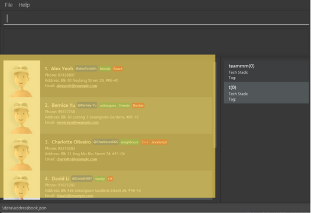

[[Jump to Table of Contents]](#table-of-contents)

---

# Features

## General Commands

<div class="alert alert-warning" markdown="1">
⚠️ <b>Notes on command format:</b>

- Words in `UPPER_CASE` are the parameters to be supplied by the user.<br>
  e.g. in `add n/NAME`, `NAME` is a parameter which can be used as `add n/John Doe`.

- Items in square brackets are optional.<br>
  e.g. `n/NAME [t/TAG] [ts/TECH_STACK]` can be used as `n/John Doe t/friend ts/Java` or as `n/John Doe`.

- Items with `…`​ after them can be used multiple times including zero times.<br>
  e.g. `[t/TAG]…​` can be used as ` ` (i.e. 0 times), `t/friend`, `t/friend t/family` etc.

- Parameters can be in any order.<br>
  <i>Note: Excluding Rate Command.</i><br>
  e.g. if the command specifies `n/NAME p/PHONE_NUMBER`, `p/PHONE_NUMBER n/NAME` is also acceptable.

- Extraneous parameters for commands that do not take in parameters (such as `help`, `list`, `exit` and `clear`) will be ignored.<br>
  e.g. if the command specifies `help 123`, it will be interpreted as `help`.

- If you are using a PDF version of this document, be careful when copying and pasting commands that span multiple lines as space characters surrounding line-breaks may be omitted when copied over to the application.
</div>

### Listing all contacts : `list`

You can view a list of all your contacts in CodeConnect with this command.

**Format:**

```
list
```

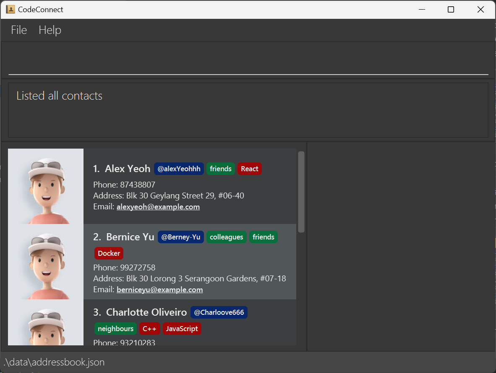

[[Jump to Features]](#features)

### Adding a contact: `add`

You can add any new developer that you have just met into CodeConnect with this command.

**Format:**

```
add n/NAME p/PHONE_NUMBER e/EMAIL a/ADDRESS g/GITHUB_USERNAME [pp/PROFILE_PICTURE] [t/TAG]…​ [ts/TECH_STACK]…​
```

<div class="alert alert-info" markdown="1">
ℹ️ <b>Tips:</b>

- Each contact can only have a maximum of 3 tags and 3 tech stacks.
</div>
<div class="alert alert-warning" markdown="1">
⚠️ Contacts are considered duplicates if they share the same name or GitHub username.
</div>

**Examples:**

- `add n/John Doe p/98765432 e/johnd@example.com a/John street, block 123, #01-01 g/johnDoee pp/https://api-prod-minimal-v510.vercel.app/assets/images/avatar/avatar_1.jpg`
- `add n/Betsy Crowe t/friend e/betsycrowe@example.com a/Newgate Prison p/1234567 g/betBetty t/criminal ts/Flutter pp/https://api-prod-minimal-v510.vercel.app/assets/images/avatar/avatar_1.jpg`

| Prior                                                  | After                                                |
|:-------------------------------------------------------|:-----------------------------------------------------|
|  | 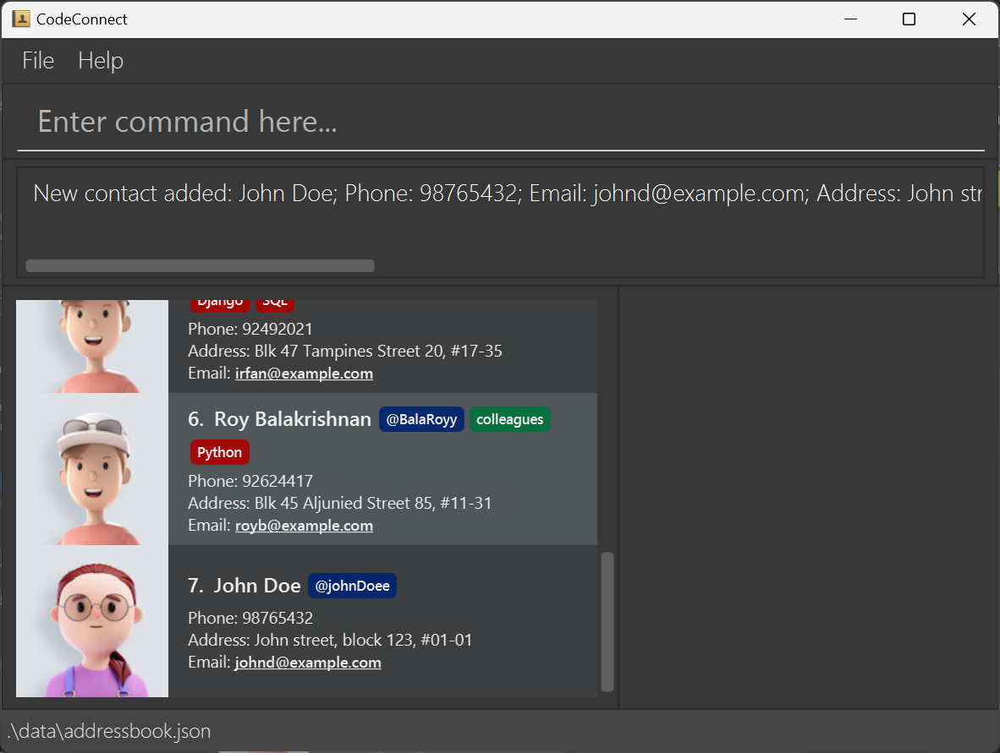 |

[[Jump to Features]](#features)

### Editing a contact : `edit`

You can edit any contact saved in CodeConnect at the specified `INDEX` with this command. 

**Format:**

```
edit INDEX [n/NAME] [p/PHONE] [e/EMAIL] [a/ADDRESS] [g/GITHUB_USERNAME] [pp/PROFILE_PICTURE] [t/TAG]…​ [ts/TECH_STACK]…​
```

<div class="alert alert-info" markdown="1">
<b>ℹ️ Tips: </b>

- Existing values will be updated to the input values. <br>
- When editing tags or tech stack, the existing tags or tech stack of the contact will be removed (i.e. adding is not cumulative.) 
- Existing tech stack, together with ratings, will be removed and replaced by input tech stack.
- You can remove all the contact’s tags and tech stack by typing `t/` and `ts/` without specifying any tags after it.
</div>
<div class="alert alert-warning" markdown="1">
⚠️ At least one of the optional fields must be provided. <br>
</div>

**Examples:**

- `edit 1 p/91234567 e/johndoe@example.com` edits the phone number and email address of the 1st contact to be `91234567` and `johndoe@example.com` respectively.
- `edit 2 n/Betsy Crower t/` edits the name of the 2nd contact to be `Betsy Crower` and clears all existing tags.

| Prior                                                    | After                                                  |
|:---------------------------------------------------------|:-------------------------------------------------------|
|  | 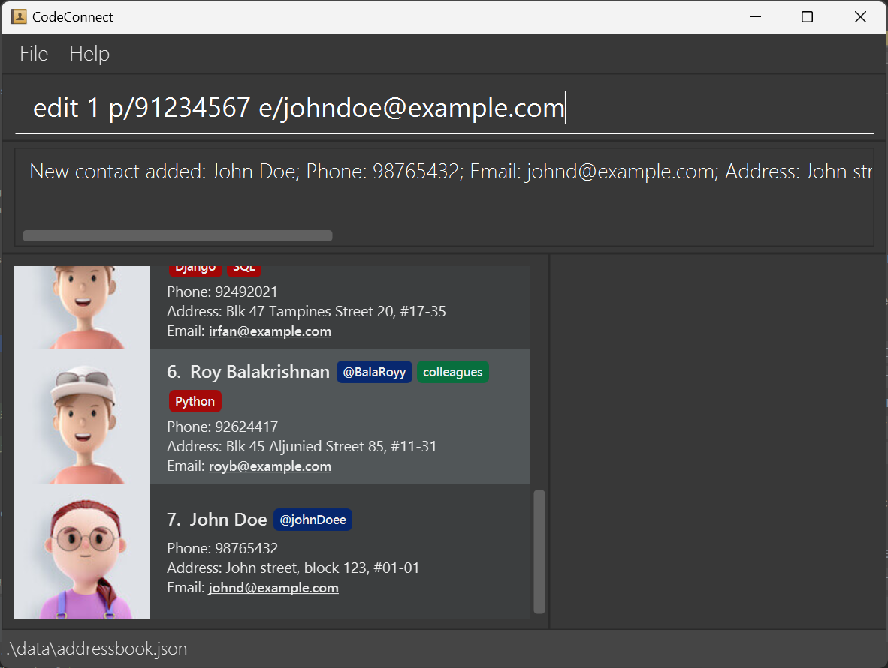 |

[[Jump to Features]](#features)

### Locating contacts by name: `find`

You can find any contacts whose names contain any of the given keywords with this command.

**Format:**

```
find KEYWORD [MORE_KEYWORDS]
```

<div class="alert alert-info" markdown="1">
ℹ️ <b>Tips:</b>

- The search is case-insensitive. e.g. `hans` will match `Hans` <br>
- The order of the keywords does not matter. e.g. `Hans Bo` will match `Bo Hans` <br>
- Only the name is searched. <br>
- Only full words will be matched e.g. `Han` will not match `Hans` <br>
- Contacts matching at least one keyword will be returned (i.e. `OR` search).
e.g. `Hans Bo` will return `Hans Gruber`, `Bo Yang`
</div>

**Examples:**

- `find John` returns `John Doe`
- `find alex david` returns `Alex Yeoh`, `David Li`

| Prior                                                    | After                                                  |
|:---------------------------------------------------------|:-------------------------------------------------------|
|  | 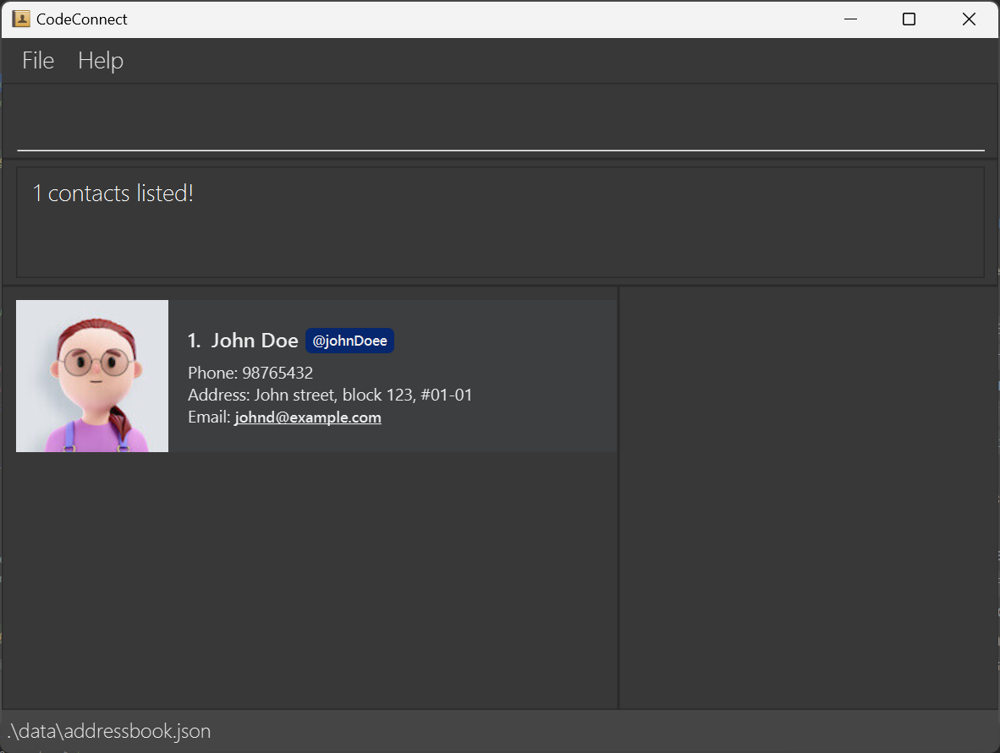 |

[[Jump to Features]](#features)

### Locating contacts by tags: `find-tags`

You can find any contacts whose tags contain all the given keywords with this command.

**Format:**

```
find-tags KEYWORD [MORE_KEYWORDS]
```

<div class="alert alert-info" markdown="1">
ℹ️ <b>Tips:</b>

- The search is case-insensitive. e.g. `school` will match `School` <br>
- Only the tags are searched. <br>
- Only full words will be matched e.g. `school` will not match `schools` <br>
- Contacts matching all keywords will be returned (i.e. `AND` search).
</div>

**Examples:**

- `find-tags classmates` returns anyone with the tag `classmates`

| Prior                                                              | After                                                            |
|:-------------------------------------------------------------------|:-----------------------------------------------------------------|
|  | 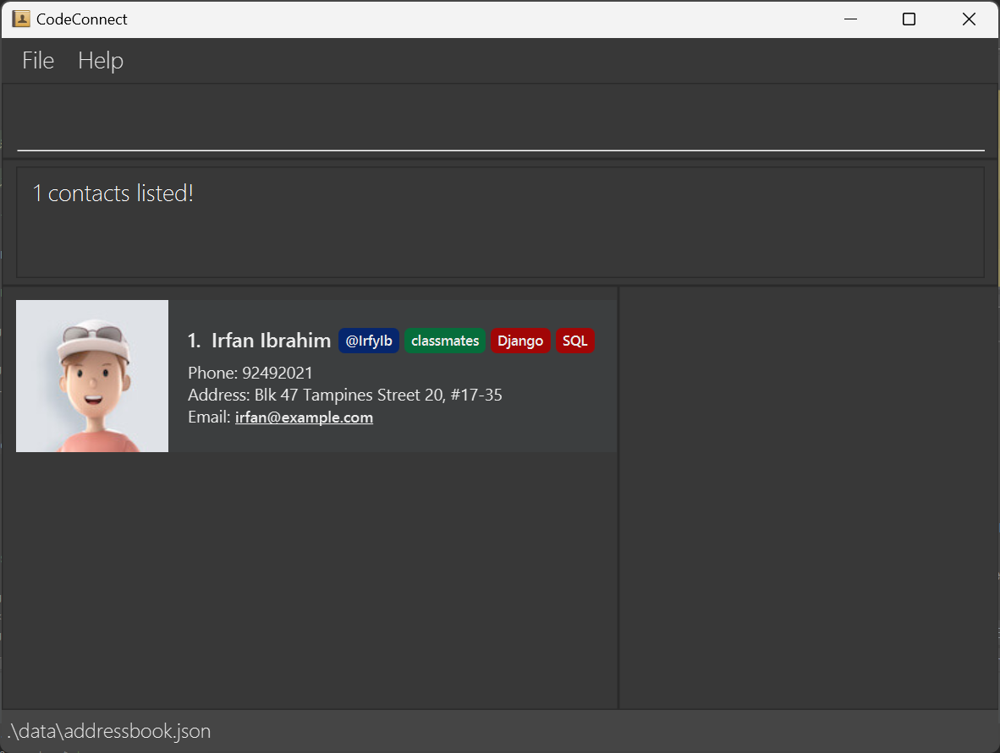 |

[[Jump to Features]](#features)

### Locating contacts by tech stack: `find-ts`

You can find any contacts whose tech stack contain all the given keywords with this command.

**Format:**

```
find-ts KEYWORD [MORE_KEYWORDS]
```

<div class="alert alert-info" markdown="1">
ℹ️ <b>Tips:</b>

- The search is case-insensitive. e.g. `java` will match `Java` <br>
- Only the tech stack are searched. <br>
- Only full words will be matched e.g. `java` will not match `javascript` <br>
- Contacts matching all keywords will be returned (i.e. `AND` search).
</div>

**Examples:**

- `find-ts Python` returns anyone with the tech stack `Python`

| Prior                                                          | After                                                        |
|:---------------------------------------------------------------|:-------------------------------------------------------------|
| 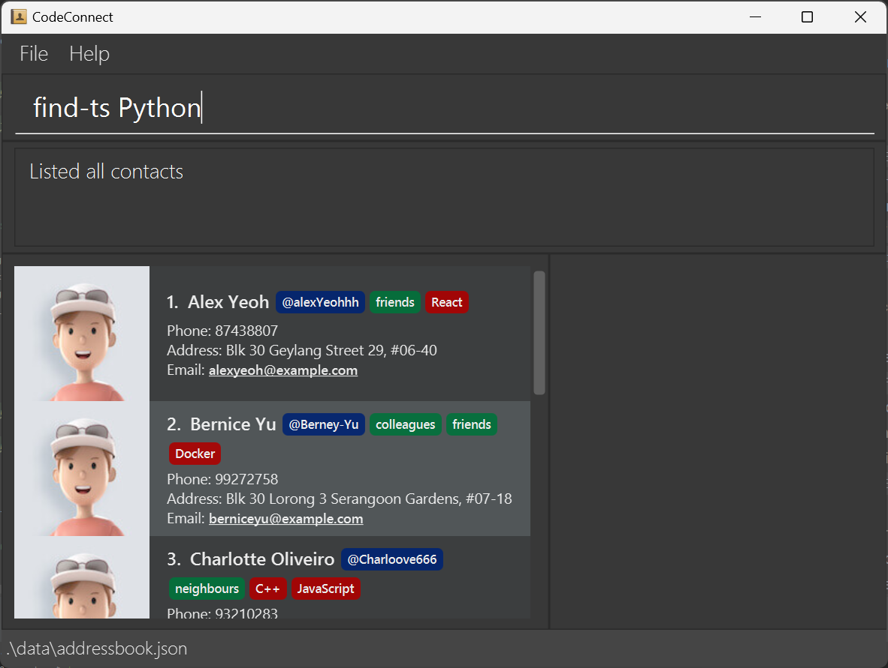 | 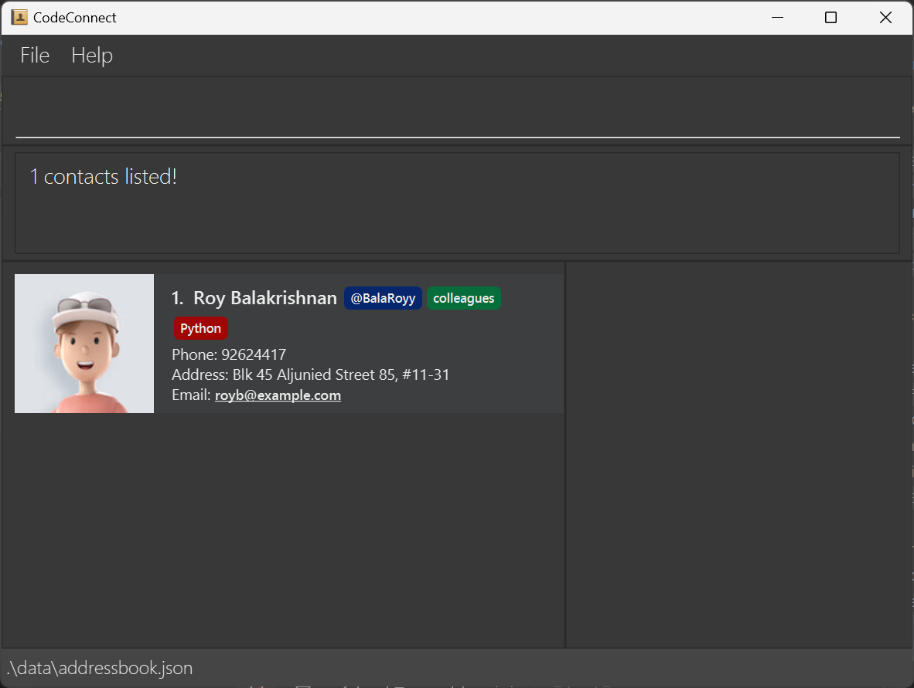 |

[[Jump to Features]](#features)

### Rate skills of contacts: `rate`

You can rate any specified skill of any specified contact with this command.

**Format:**

```
rate INDEX ts/KEYWORD r/RATING
```

<div class="alert alert-info" markdown="1">
ℹ️ <b>Tips:</b>

- The rating is case-sensitive. e.g. `java` will not match `Java` <br>
- Only supports the rating of 1 tech stack per command. <br>
- Only the tech stack in specified contact are searched. <br>
- Only full words will be matched e.g. `java` will not match `javascript`
</div>

**Examples:**

- `rate 1 ts/React r/8` rates the skill of React of the first contact as 8.

| Prior                                                    | After                                                  |
|:---------------------------------------------------------|:-------------------------------------------------------|
|  |  |

[[Jump to Features]](#features)

### Deleting a contact : `delete`

You can delete any specified contact from CodeConnect with this command.

**Format:**

```
delete INDEX
```

<div class="alert alert-info" markdown="1">
ℹ️ <b>Tips:</b>

- Deletes the contact at the specified `INDEX`. <br>
- The index refers to the index number shown in the displayed contact list.
</div>

**Examples:**

- `list` followed by `delete 2` deletes the 2nd contact in the address book.
- `find Betsy` followed by `delete 1` deletes the 1st contact in the results of the `find` command.

| Prior                                                        | After                                                      |
|:-------------------------------------------------------------|:-----------------------------------------------------------|
|  | 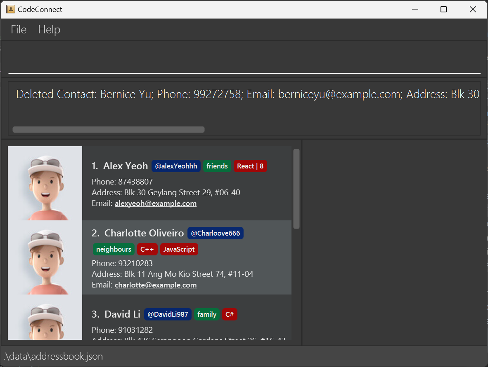 |

[[Jump to Features]](#features)

### Clearing all entries : `clear`

You can clear all contacts from CodeConnect with this command. 

**Format:**

```
clear
```

<div class="alert alert-danger" markdown="1">
❗<b>Warning:</b>

- This action is irreversible.
- We caution against doing this unless you are very sure about what you are doing 😱.
</div>

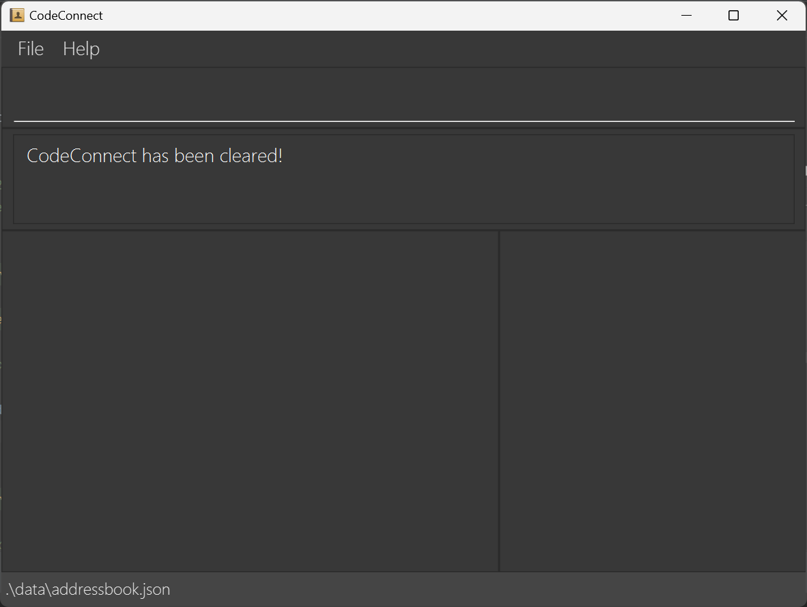

[[Jump to Features]](#features)

### Viewing help : `help`

You can view a link to this user guide with this command.

**Format:**

```
help
```

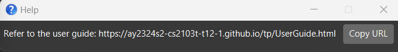

[[Jump to Features]](#features)

### Exiting the program : `exit`

You can exit the program with this command.

**Format:**

```
exit
```

[[Jump to Features]](#features)

## Team commands

<div class="alert alert-warning" markdown="1">
⚠️ <b>Notes on team command format: </b>

- All team related commands start with the prefix: `team`
</div>

### Adding a team: `add`

You can add a new hackathon team to CodeConnect with this command.

**Format:**

```
team add n/TEAM_NAME
```

<div class="alert alert-info" markdown="1">
ℹ️ <b>Tips:</b>

- Each team in CodeConnect needs to have a unique name. <br>
- Team names are case-sensitive (i.e. two teams named `NUS HACK 2024` and `Nus Hack 2024` are allowed).
</div>

**Examples:**

- `team add n/NUS HACK 2024` adds a new team named `NUS HACK 2024` into the teams list.

| Prior                                                            | After                                                          |
|:-----------------------------------------------------------------|:---------------------------------------------------------------|
| 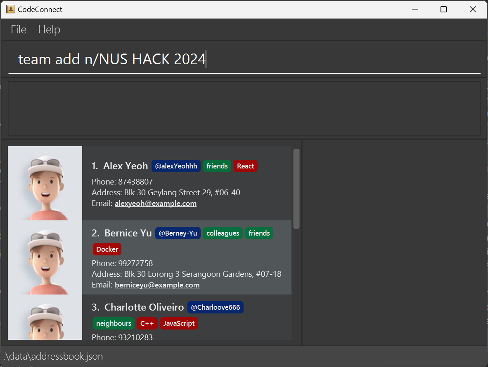 |  |

[[Jump to Team Commands]](#team-commands) <br/>
[[Jump to Features]](#features)

### Deleting a team: `delete`

You can delete a team from your team list with this command.

**Format:**

```
team TEAM_INDEX delete
```

<div class="alert alert-info" markdown="1">
ℹ️ <b>Tips:</b>

- Deletes the team at the specified `TEAM_INDEX`. <br>
- The index refers to the index number shown in the displayed teams list. <br>
</div>

**Examples:**

- `team 1 delete` deletes the first team in the team list.

| Prior                                                                  | After                                                                |
|:-----------------------------------------------------------------------|:---------------------------------------------------------------------|
| 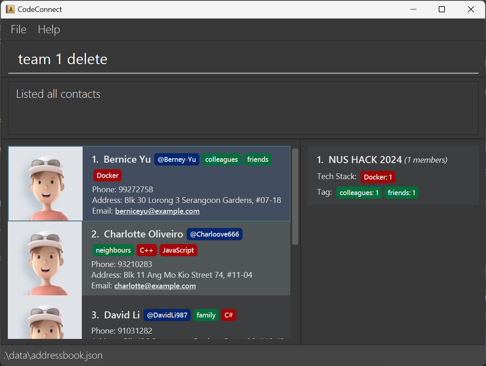 | 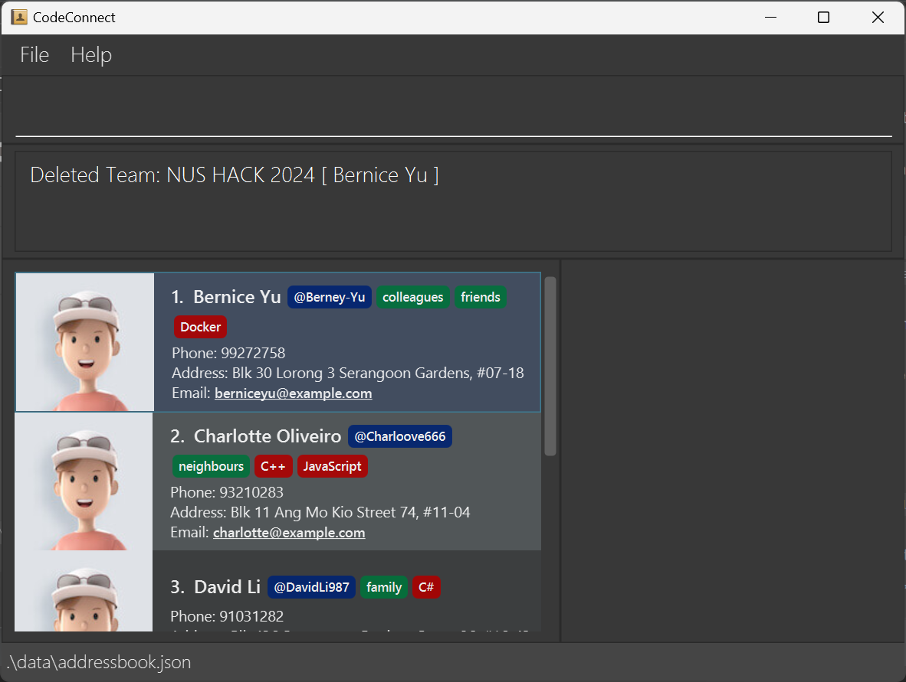 |

[[Jump to Team Commands]](#team-commands) <br/>
[[Jump to Features]](#features)

### List members belonging to a team:

You can view a list of all the members of a specific team in your team list with this command.

**Format:**

```
team TEAM_INDEX
```

<div class="alert alert-info" markdown="1">
ℹ️ <b>Tips:</b>

- Lists the members' details of the team at the specified `TEAM_INDEX`. <br>
- The index refers to the index number shown in the displayed teams list.
</div>

**Examples:**

- `team 1` shows a list of all the members of the first team.

| Prior                                                              | After                                                            |
|:-------------------------------------------------------------------|:-----------------------------------------------------------------|
|  | 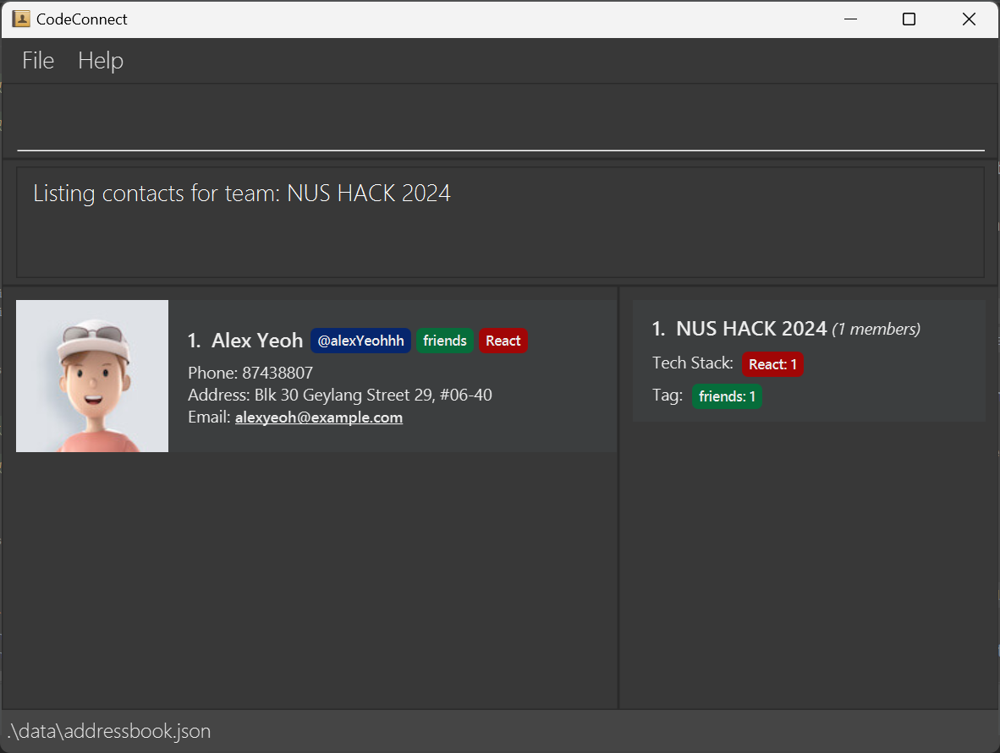 |

[[Jump to Team Commands]](#team-commands) <br/>
[[Jump to Features]](#features)

### Adding a contact to a team: `add-contact`

You can add a contact to a specific team in your team list with this command.

**Format:**

```
team TEAM_INDEX add-contact CONTACT_INDEX
```

<div class="alert alert-info" markdown="1">
ℹ️ <b>Tips:</b>

- Adds the contact at the specified `CONTACT_INDEX` to the team at the specified `TEAM_INDEX`. <br>
- The `TEAM_INDEX` refers to the index number of the team shown in the displayed teams list. <br>
- The `CONTACT_INDEX` refers to the index number of the contact shown in the contact list the user sees.
</div>

<div class="alert alert-warning" markdown="1">
⚠️ <b>Current Limitations</b>:

- You can only add a contact from the currently displayed list of contacts.
- To choose from all your contacts, first enter the command `list` to view all contacts and then add a contact to the team.
</div>

**Examples:**

- `team 1 add-contact 1` adds the contact at index 1 of the contact list you are currently viewing to the first team in the team list.
- Enter `team 1` to view the updated members of the team.

| Prior                                                                           | After                                                                          |
| :------------------------------------------------------------------------------- | :----------------------------------------------------------------------------- |
|  | 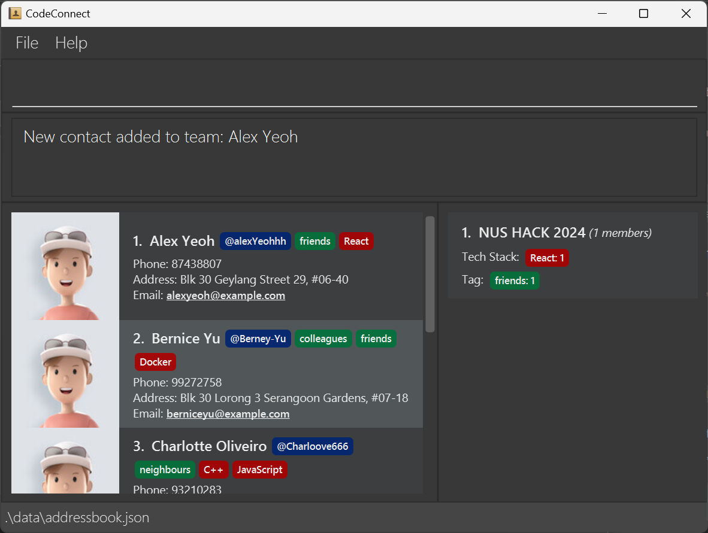 |

[[Jump to Team Commands]](#team-commands) <br/>
[[Jump to Features]](#features)

### Deleting a contact from a team: `delete-contact`

You can delete a contact from a specific team in your team list with this command.

**Format:**

```
team TEAM_INDEX delete-contact CONTACT_INDEX
```

<div class="alert alert-info" markdown="1">
ℹ️ <b>Tips:</b>

- Deletes the contact at the specified `CONTACT_INDEX` from the team at the specified `TEAM_INDEX`.
- The `TEAM_INDEX` refers to the index number of the team shown in the displayed teams list.
- The `CONTACT_INDEX` refers to the index number of the contact shown in the contact list the user sees.
</div>
<div class="alert alert-warning" markdown="1">
⚠️ <b>Current Limitations</b>:

- You can only delete a contact from the current displayed list of contacts.
- To delete a contact from a team, first enter the command `team TEAM_INDEX` to view all contacts in the team and then delete a contact from the team.
- The UI will not show the updated team members list after you delete a contact from a team. To view the updated team members list, enter the command `team TEAM_INDEX` again.
</div>

**Examples:**

- `team 1 delete-contact 1` deletes the contact at index 1 from the first team in the team list.
- Enter `team 1` to view the updated members of the team.

| Prior                                                                                 | After                                                                                |
| :------------------------------------------------------------------------------------- | :----------------------------------------------------------------------------------- |
| 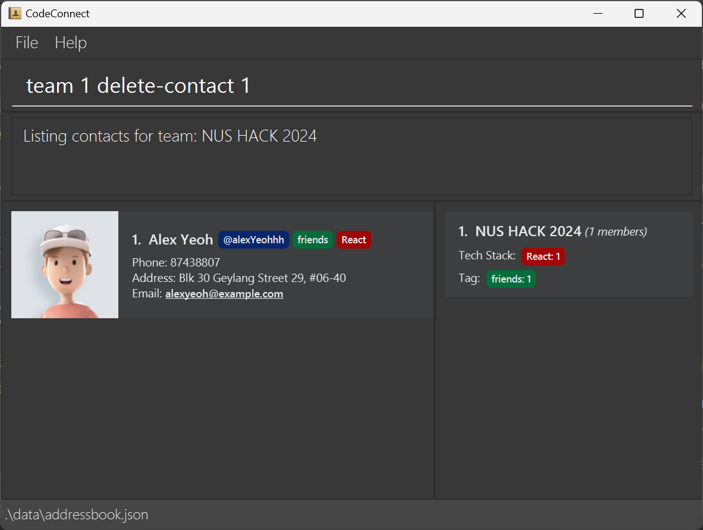 | 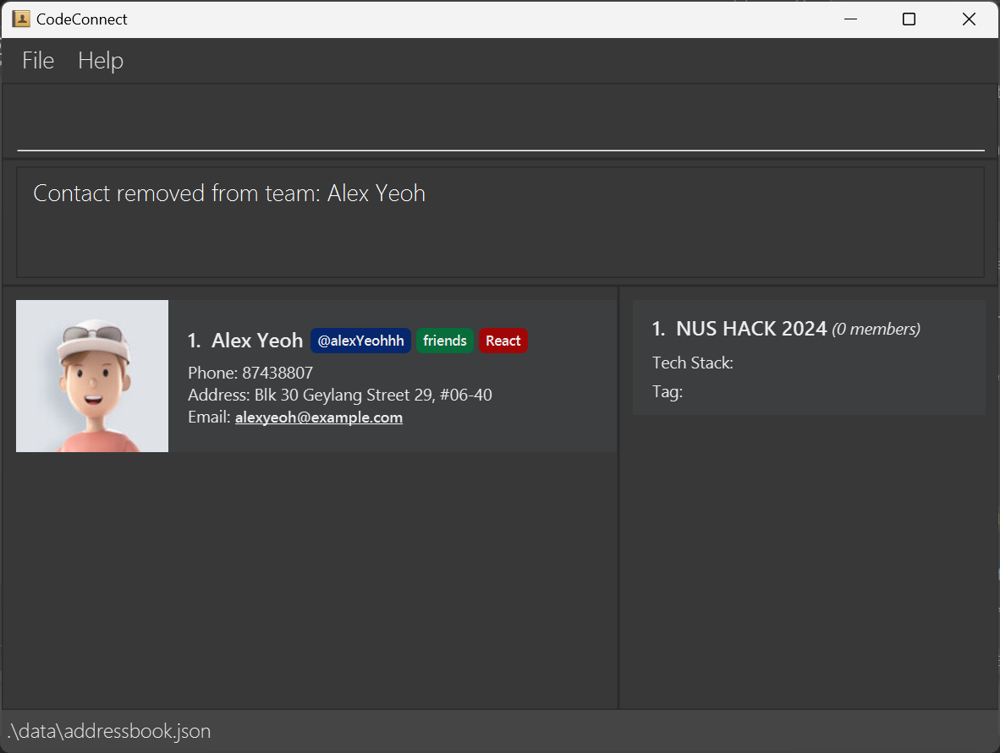 |

[[Jump to Team Commands]](#team-commands) <br/>
[[Jump to Features]](#features)

### Exporting team details: `export`

You can export the members' details of a specific team in your team list with this command.

**Format:**

```
team TEAM_INDEX export
```

<div class="alert alert-info" markdown="1">
ℹ️ <b>Tips:</b>

- Exports the members' details of the team at the specified `TEAM_INDEX`.
- Only the name, phone number, email, address, and GitHub username of the contact will be exported.
</div>

**Examples:**

- `team 1 export` exports the members' details of the 1st team in the teams list.

| Prior                                                                 | After                                                                |
| :--------------------------------------------------------------------- | :------------------------------------------------------------------- |
| 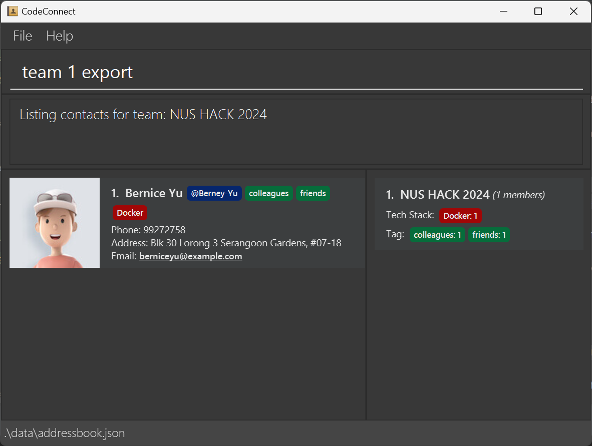 | 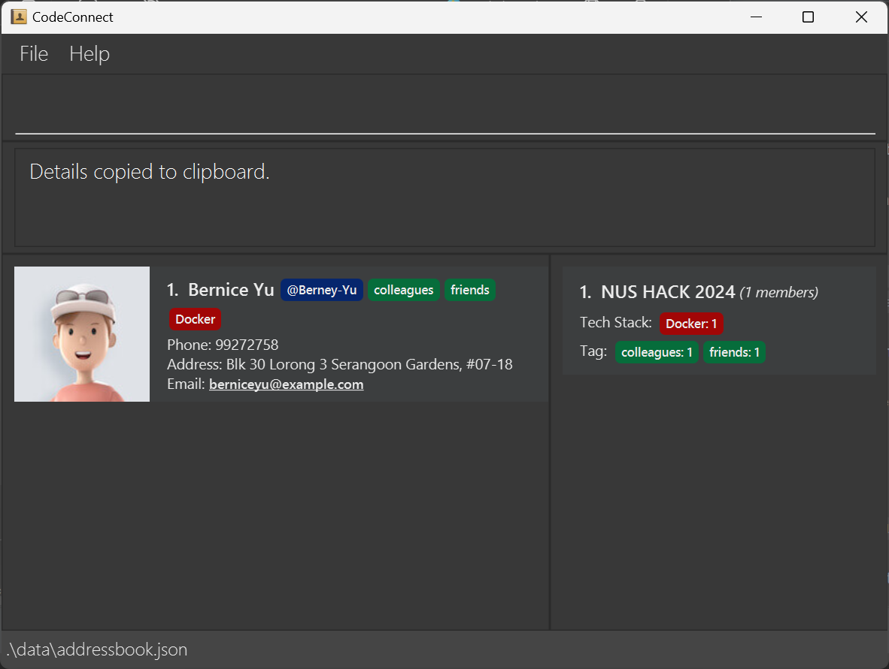 |

**Details exported to clipboard:**

```
Member 1
Name: Bernice Yu
Phone Number: 99272758
Email: berniceyu@example.com
Address: Blk 30 Lorong 3 Serangoon Gardens, #07-18
GitHub Username: Berney-Yu
```

[[Jump to Team Commands]](#team-commands) <br/>
[[Jump to Features]](#features)

## Non-CLI Features

### Email a contact

You can open a desktop mail application to directly email a specific contact.

**How to use:**

- Click on the contact's email.

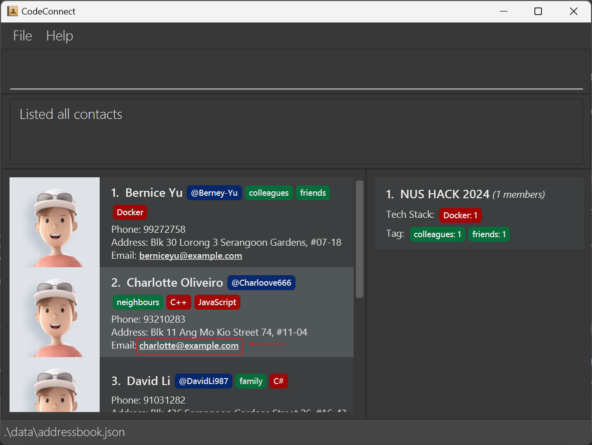

[[Jump to Non-CLI Features]](#non-cli-features) <br/>
[[Jump to Features]](#features)

### Command History

You can navigate through your past commands.

**How to use:**

- Use the up and down arrow keys to navigate through your history while the command input is in focus.

<div class="alert alert-info" markdown="1">
ℹ️ <b>Tips:</b>

- Any commands you have run previously <i>during the current session</i> are saved in the command history.
- Any edits you make to a saved command will be stored as you navigate through your history.
- The command input is in focus when the cursor is blinking in the input field.
</div>

| Before pressing the Up Arrow Key                                               | After pressing the Up Arrow Key once                                         |
|:-------------------------------------------------------------------------------|:-----------------------------------------------------------------------------|
| 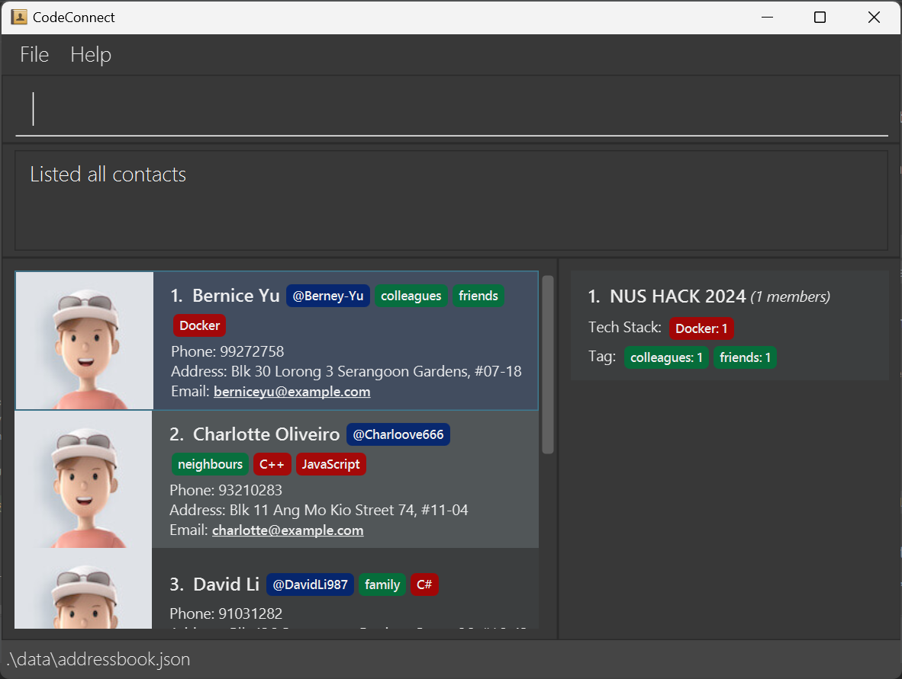 |  |

[[Jump to Non-CLI Features]](#non-cli-features) <br/>
[[Jump to Features]](#features)

### Saving the data

CodeConnect data is saved in the hard disk automatically after any command that changes the data. You do not need to save anything manually.

[[Jump to Non-CLI Features]](#non-cli-features) <br/>
[[Jump to Features]](#features)

### Editing the data file

CodeConnect data is saved automatically as a JSON file `[JAR file location]/data/addressbook.json`. If you are an advanced user, feel free to update data directly by editing that data file.

<div class="alert alert-danger" markdown="1">
❗<b>Warning:</b>

- If your changes to the data file makes its format invalid, CodeConnect will discard all data and start with an empty data file at the next run. Hence, it is recommended to take a backup of the file before editing it.<br>
- Furthermore, certain edits can cause the CodeConnect to behave in unexpected ways (e.g., if a value entered is outside the acceptable range). Therefore, edit the data file only if you are confident that you can update it correctly.
</div>

[[Jump to Non-CLI Features]](#non-cli-features) <br/>
[[Jump to Features]](#features) <br/>
[[Jump to Table of Contents]](#table-of-contents)

---

# FAQ

**Q**: How can I report a bug?<br>
**A**: Feel free to create an issue for the bug [here](https://github.com/AY2324S2-CS2103T-T12-1/tp/issues). Be sure to include all the details about the bug and how it's popping up. Your input means the world to us!

**Q**: Can I change up the font and colors of the application?<br>
**A**: For now, we're keeping it sleek and simple. Customisable features aren't on the menu at the moment. But hey, who knows what the future holds? Keep an eye out for updates!

**Q**: Can I use the application offline?<br>
**A**: This application's got your back even when the Wi-Fi's down. Your tasks and progress will be safe on your local computer.

**Q**: How do I transfer my data to another computer?<br>
**A**: Install the application in the other computer and overwrite the empty data file it creates with the file that contains the data of your previous CodeConnect home folder.

[[Jump to Table of Contents]](#table-of-contents)

---

# Known Issues

1. **When using multiple screens**, if you move the application to a secondary screen, and later switch to using only the primary screen, the GUI will open off-screen. The remedy is to delete the `preferences.json` file created by the application before running the application again.

[[Jump to Table of Contents]](#table-of-contents)

---

# Command Summary

| Action                    | Format, Examples                                                                                                                                                                                                                                                                                                                        |
|---------------------------|-----------------------------------------------------------------------------------------------------------------------------------------------------------------------------------------------------------------------------------------------------------------------------------------------------------------------------------------|
| **List**                  | `list`                                                                                                                                                                                                                                                                                                                                  |
| **Add**                   | `add n/NAME p/PHONE_NUMBER e/EMAIL a/ADDRESS g/GITHUB_USERNAME [pp/PROFILE_PICTURE] [t/TAG] [ts/TECH_STACK]…​` <br> e.g., `add n/James Ho p/22224444 e/jamesho@example.com a/123, Clementi Rd, 1234665 g/Jamesho123  pp/https://api-prod-minimal-v510.vercel.app/assets/images/avatar/avatar_1.jpg t/friend t/colleague ts/Java ts/C++` |
| **Edit**                  | `edit INDEX [n/NAME] [p/PHONE_NUMBER] [e/EMAIL] [a/ADDRESS] [g/GITHUB_USERNAME] [pp/PROFILE_PICTURE] [t/TAG]…​ [ts/TECH_STACK]…​ `<br> e.g.,`edit 2 n/James Lee e/jameslee@example.com`                                                                                                                                                 |
| **Find**                  | `find KEYWORD [MORE_KEYWORDS]`<br> e.g., `find James Jake`                                                                                                                                                                                                                                                                              |
| **Find by Tags**          | `find-tags KEYWORD [MORE_KEYWORDS]`<br> e.g., `find-tags School Work`                                                                                                                                                                                                                                                                   |
| **Find by Tech Stack**    | `find-ts KEYWORD [MORE_KEYWORDS]`<br> e.g., `find-ts Java Python`                                                                                                                                                                                                                                                                       |
| **Rate**                  | `rate INDEX ts/TECH_STACK r/RATING`<br> e.g., `rate 3 ts/Java r/7`                                                                                                                                                                                                                                                                      |
| **Delete**                | `delete INDEX`<br> e.g., `delete 3`                                                                                                                                                                                                                                                                                                     |
| **Clear**                 | `clear`                                                                                                                                                                                                                                                                                                                                 |
| **Help**                  | `help`                                                                                                                                                                                                                                                                                                                                  |
| **Exit**                  | `exit`                                                                                                                                                                                                                                                                                                                                  |
| **Team - Add**            | `team add n/NAME`<br> e.g., `team add n/NUS HACK 2024`                                                                                                                                                                                                                                                                                  |
| **Team - Delete**         | `team TEAM_INDEX delete`<br> e.g., `team 1 delete`                                                                                                                                                                                                                                                                                      |
| **Team - List**           | `team TEAM_INDEX`<br> e.g., `team 1`                                                                                                                                                                                                                                                                                                    |
| **Team - Add Contact**    | `team TEAM_INDEX add-contact CONTACT_INDEX`<br> e.g., `team 2 add-contact 3`                                                                                                                                                                                                                                                            |
| **Team - Delete Contact** | `team TEAM_INDEX delete-contact CONTACT_INDEX`<br> e.g., `team 1 delete-contact 4`                                                                                                                                                                                                                                                      |
| **Team - Export Details** | `team TEAM_INDEX export`<br> e.g., `team 1 export`                                                                                                                                                                                                                                                                                      |

[[Jump to Table of Contents]](#table-of-contents)

---

# Parameter Constraints

| Parameter               | Prefix | Acceptable Values                                                                                                                                 | Examples                                                                        |
|-------------------------|--------|---------------------------------------------------------------------------------------------------------------------------------------------------|---------------------------------------------------------------------------------|
| **Name**                | n/     | Must contain only alphanumeric characters and may include spaces. All names must be unique.                                                       | `n/John Doe`                                                                    |
| **Address**             | a/     | Can contain any values.                                                                                                                           | `a/Blk 30 Lorong 3 Serangoon Gardens, #07-18`                                   |
| **Phone Number**        | p/     | Must contain only numeric characters and should be at least 3 digits long.                                                                        | `p/91234567`                                                                    |
| **Email Address**       | e/     | Can contain any values.                                                                                                                           | `e/yolo@gmail.com`                                                              |
| **GitHub Username**     | g/     | Must contain only alphanumeric characters and hyphens (-). All usernames must be unique.                                                          | `g/JohnDoe`                                                                     |
| **Profile Picture**     | pp/    | Must be a valid URI to an image. Supports .PNG, .JPG, .JPEG and .GIF formats.                                                                     | `pp/https://api-prod-minimal-v510.vercel.app/assets/images/avatar/avatar_1.jpg` |
| **Tags**                | t/     | Must contain only alphanumeric characters. They are limited to only 15 characters.                                                                | `t/friend`                                                                      |
| **Tech Stack**          | ts/    | Must contain only alphanumeric characters, underscores(\_), hashtags(#), hyphens(-), periods(.) and plus signs(+). Limited to only 15 characters. | `ts/Java`                                                                       |
| **Rating**              | r/     | Must be an integer between 0 (inclusive) and 10 (inclusive).                                                                                      | `r/7`                                                                           |
| **Index/Contact_Index** | NIL    | Must be a positive integer which is not greater than the number of contacts in the currently displayed contact list.                              | `3`                                                                             |
| **Team Name**           | n/     | Must contain only alphanumeric characters and spaces. All team names must be unique.                                                              | `n/NUS HACK 2024`                                                               |
| **Team Index**          | NIL    | Must be a positive integer which is not greater than the number of teams in the address book.                                                     | `2`                                                                             |

<div class="alert alert-warning" markdown="1">
   ⚠️ <b> While the email address field accepts any values, it is important to adhere to the following: </b>
    <ul>
        <li> The local-part before the '@' symbol can only contain alphanumeric characters and the special characters "+_.-".</li>
        <li> The local-part cannot start or end with any special characters.</li>
        <li> After the '@' symbol, there should be a domain name composed of domain labels separated by periods.</li>
        <li> The domain name must end with a label containing at least 2 characters.</li>
        <li> Each domain label should start and end with alphanumeric characters, and consist only of alphanumeric characters with hyphens allowed as separators, if necessary. </li>
    </ul>
</div>
<div class="alert alert-warning" markdown="1">
   ⚠️ <b> When entering the tech stack for the `rate` command: </b>
<ul>
        <li> The tech stack must be one of the tech stacks that the contact at the specific index has. </li>
</ul>
</div>

[[Jump to Table of Contents]](#table-of-contents)
