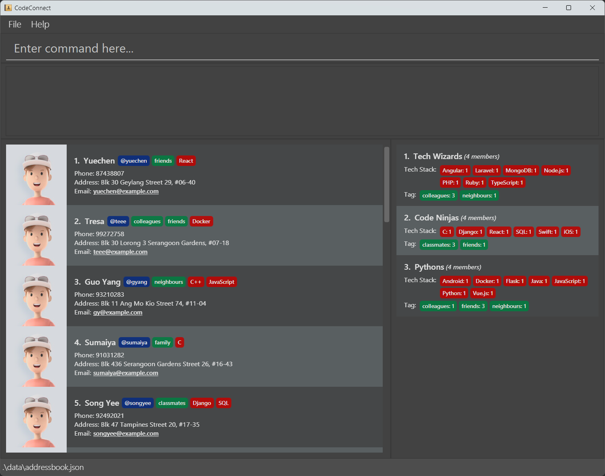

# CodeConnect

CodeConnect is a **developer-first networking application** for student developers to keep track of and reach out easily to other student developers, so they can easily form teams for hackathons. 
While it has a GUI, most of the user interactions happen using a **CLI (Command Line Interface)**.

* If you are interested in using CodeConnect, head over to the [_Installation Guide_ section of the **User Guide**](UserGuide.html#installation-guide).
* If you are interested about developing CodeConnect, the [**Developer Guide**](DeveloperGuide.html) is a good place to start.

**Acknowledgements**

* Libraries used: [JavaFX](https://openjfx.io/), [Jackson](https://github.com/FasterXML/jackson), [JUnit5](https://github.com/junit-team/junit5)
